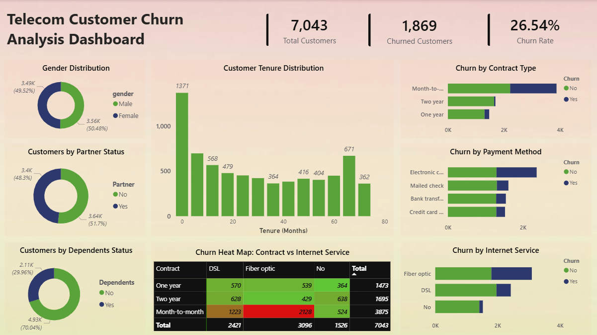

# Customer Churn Analysis and Prediction Using Power BI

## Overview
This project analyzes customer churn data using Microsoft Power BI to identify customer retention patterns and key factors influencing customer attrition. An interactive dashboard was developed to transform raw customer data into actionable business insights and support data-driven decision-making.

## Objectives
- Analyze customer churn behavior and retention trends.
- Calculate key churn-related performance metrics.
- Understand customer demographics and tenure patterns.
- Identify major factors contributing to customer churn.
- Develop an interactive Power BI dashboard.
- Generate business recommendations to improve customer retention.

## Tools Used
- Microsoft Power BI Desktop
- Power Query
- DAX (Data Analysis Expressions)

## Project Workflow
1. Data Acquisition
   - Imported the Telco Customer Churn dataset into Power BI.

2. Data Preparation
   - Removed blank records.
   - Handled missing values.
   - Validated data types.
   - Created a Churn_Flag column.
   - Created tenure bins for analysis.

3. KPI Development
   - Total Customers
   - Churned Customers
   - Churn Rate

4. Data Analysis
   - Customer Demographics Analysis
   - Customer Tenure Analysis
   - Churn Analysis

5. Dashboard Development
   - Designed an interactive dashboard with multiple visualizations and KPI cards.

6. Business Insights & Recommendations
   - Identified churn drivers and proposed retention strategies.

## Dashboard Features
- Total Customers KPI Card
- Churned Customers KPI Card
- Churn Rate KPI Card
- Gender Distribution Analysis
- Partner Status Analysis
- Dependents Status Analysis
- Customer Tenure Histogram
- Churn by Contract Type
- Churn by Payment Method
- Churn by Internet Service
- Churn Heatmap

## Key Insights
- Customers with month-to-month contracts exhibit the highest churn rates.
- Fiber Optic customers show higher churn compared to DSL customers.
- Electronic Check users contribute significantly to customer attrition.
- Customers with shorter tenure periods are more likely to churn.
- Long-term customers demonstrate stronger retention and loyalty.

## Recommendations
- Encourage customers to switch to long-term contracts through incentives and loyalty programs.
- Improve customer experience for Fiber Optic subscribers.
- Strengthen onboarding programs for newly acquired customers.
- Develop targeted retention strategies for high-risk customer segments.
- Monitor churn trends regularly using dashboard insights.

## Skills Demonstrated
- Data Cleaning & Transformation
- Data Modeling
- DAX Calculations
- KPI Development
- Data Visualization
- Dashboard Design
- Business Intelligence Reporting
- Analytical Thinking
- Data-Driven Decision Making

## Dashboard Preview

## Author
**Sahinka Sarkar**
